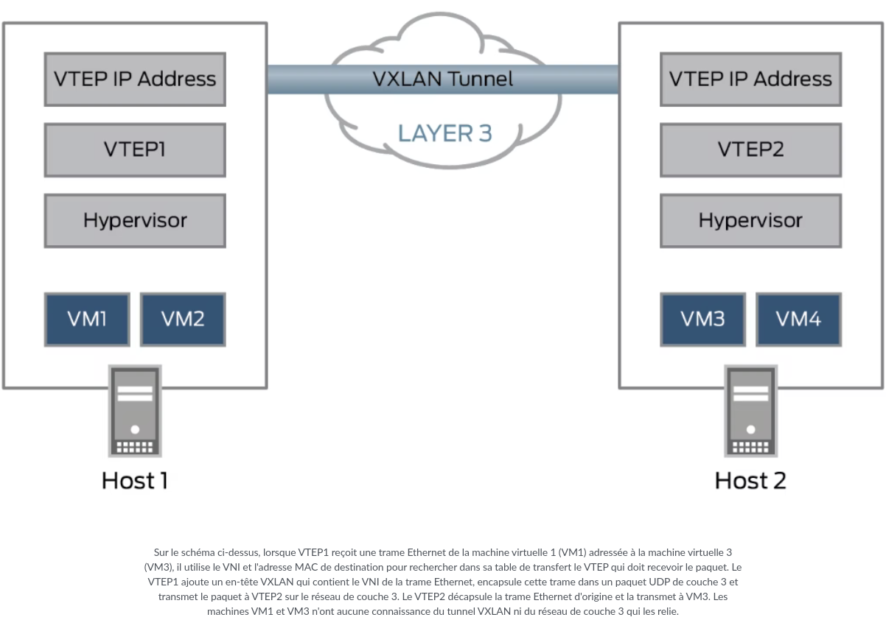

# Def 

-	**<u>BGP**</u> *Border Gateway Protocol (protocole de passerelle en bordure)* - **[RFC 4271](http://abcdrfc.free.fr/rfc-vf/pdf/rfc1772.pdf) + [RFC 1772](http://abcdrfc.free.fr/rfc-vf/pdf/rfc1772.pdf)** : <u>Protocole de routage dynamique</u> qui permet à Internet de fonctionner en facilitant l'échange d'informations de routage entre les différents réseaux qui composent l'Internet global.

Précisément, c'est un protocole de passerelle externe standardisé conçu pour échanger des informations de routage et de joignabilité entre des systèmes autonomes (AS) sur Internet. Il est classé comme un protocole de routage à vecteur de chemin, ce qui signifie qu'il prend des décisions de routage basées sur les chemins et les politiques de réseau.

Le BGP fonctionne en établissant des sessions TCP entre des routeurs, appelés pairs BGP, pour échanger des informations de routage.

Il est également utilisé pour supporter des fonctionnalités avancées comme les réseaux privés virtuels (VPN) et le routage multicast.

Il existe deux types principaux de BGP :

-	**<u>eBGP</u>** *External BGP* : utilisé quand **2 ROUTEURS communiquent** entre 2 différents systèmes autonomes

-	**<u>iBGP</u>** *Internal BGP* : utilisé quand **2 ROUTEURS communiquent** au sein d'un même système autonome.

## <u>**ATTENTION**</u>
Pour iBGP, cela ne concerne que des informations venant de l'<u>EXTERIEUR</u> du AS. **C'est-à-dire que si un routeur `R1` recois une info d'un AS exterieur, et que ce fameux paquet exterieur (qui est chez `R1`) voit sa destination un autre routeur qui est `R2`, alors ce protocole <u>iBGP</u> est utilisé. Sinon, si c'est un paquet interne à l'AS qui doit atteindre un routeur du même AS, alors ce sera le protocole <u>OSPF</u> qui est utilisé.**

 
 

-	**<u>AS</u>** *Autonomous System* - **[RFC 1930](http://abcdrfc.free.fr/rfc-vf/pdf/rfc1930.pdf) + [RFC 4271](http://abcdrfc.free.fr/rfc-vf/pdf/rfc1772.pdf)** : Un ensemble de routeurs sous une seule administration technique. Une administration technique peut être un Fournisseur d'Accès à Internet (FAI), une entreprise, une université, etc... Chaque AS est défini par un numéro unique appelé Autonomous System Number (ASN) défini par l'[IANA](https://www.iana.org/). Ils permettent de définir une politique de routage <u>au sein de leur réseau</u>.

-	**<u>OSPF**</u> *Open Shortest Path First (itinéraire ouvert le plus court en premier)* - **[RFC 2328](https://www.rfc-editor.org/rfc/rfc2328.txt)** : <u>Protocole de routage interne</u> (donc à l'**INTERIEUR** d'un AS) <u>**IP** à état de lien</u> qui achemine des paquets au sein d'un AS. Il est utilisé par les routeurs réseau pour identifier dynamiquement les itinéraires disponibles les plus rapides et les plus courts afin d'envoyer les paquets vers leur destination. <u>**Il est largement utilisé dans les réseaux d'entreprise et les environnements où la compatibilité avec les protocoles IP est cruciale.**</u> Ce protocole utilise l'algorithme de pathfinding [Dijkstra](https://fr.wikipedia.org/wiki/Algorithme_de_Dijkstra) pour arriver à destination.

## <u>**ATTENTION**</u>
Pour OSPF, cela ne concerne que des informations venant de l'<u>INTERIEUR</u> de  l'AS. **C'est-à-dire que si un routeur `R1` recois une info d'un routeur du même AS et que sa destination est un autre routeur `R2` qui fait parti lui aussi du même AS, alors ce protocole <u>OSPF</u> est utilisé. Sinon, si c'est un paquet qui provient de l'exterieur de l'AS, alors ce sera le protocole <u>iBGP</u> qui est utilisé.**

-	**<u>IS-IS Routing</u>** *Intermediate System to Intermediate System* - **[RFC 1195](https://www.rfc-editor.org/rfc/rfc1195.txt)** : <u>Protocole de routage interne</u> (donc à l'**INTERIEUR** d'un AS) <u>**OSI** multi-protocoles à états de lien</u> qui utilise aussi [Dijkstra](https://fr.wikipedia.org/wiki/Algorithme_de_Dijkstra). IS-IS peut paraitre similaire à OSPF, car lui aussi est un protocole de routage interne multicast qui utilise Dijkstra, il est différencié de OSPF par le fait que c'est un protocole de routage réseau **OSI** et n'utilise pas IP pour la transmission des messages. Plus précisément, <u>**ce protocole a été adapté pour les réseaux IP et est souvent utilisé par les FAI en raison de sa flexibilité et de son extensibilité.**</u> [<Pour plus de compréhension et d'explication sur **<u>OSPF vs IS-IS</u>**>](https://mhd-experts.com/2020/04/16/ospf-vs-is-is-le-face-a-face/)</u>.

-	**<u>VXLAN</u>** *Virtual eXtensible Local Area Network (Réseau Local eXtensible Virtuel)* - **[RFC 7348](https://www.rfc-editor.org/rfc/rfc7348.txt)** :
	- <u>LAN</u> *Local Area Network (Réseau Local)* - **[RFC 1918](https://www.rfc-editor.org/rfc/rfc1918.html)** : Réseau informatique qui couvre une zone géographique limitée, comme un bâtiment. Les LAN sont utilisés pour connecter des dispositifs informatiques dans une zone restreinte afin de partager des ressources et des informations. LAN utilise les plages d'adressage IP définies par la [RFC 1918](https://www.rfc-editor.org/rfc/rfc1918.html). Et ces adresses ne sont pas routés sur Internet, seul des échanges entre 2 (OU PLUSIEURS) machines au sein du LAN est possible. C'est comme cela qu'on fait des LAN sur *Counter Strike* : toutes les machines sont connectées entre elles en LAN ce qi leur permet d'échanger leur informations et de pouvoir jouer en à plusieurs, chacun son PC, en **MULTIJOUEUR LOCAL**.

	- <u>VLAN</u> *Virtual Local Area Network (Réseau Local Virtuel)* : Le VLAN permet aux ingénieurs de contrôler le système de réseau tout en améliorant la sécurité et l'évolutivité. Le LAN virtuel permet de segmenter les réseaux LAN en groupes distincts, ce qui renforce la sécurité du réseau et simplifie la gestion. Les données d'un groupe restent isolées des autres groupes. <u>Le VLAN réduit le trafic de diffusion et améliore l'efficacité du réseau en **segmentant/encapsulant chaque trame logiquement un grand réseau en réseaux de taille plus réduite**.</u> Il existe 2 méthodes courantes de configuration VLAN (statique et dynamique) et plusieurs catégories de <u>VLAN dynamiques</u>. [<Pour plus de détail sur les <u>**différentes méthodes de configuration VLAN et ses différentes catégories**</u>>](https://community.fs.com/fr/article/vlan-how-does-it-change-your-network-management.html) (Mais aussi sa [page Wikipédia](https://en.wikipedia.org/wiki/VLAN)).

	- <u>Ethernet</u> : Ethernet est un protocole de communication utilisé pour les réseaux informatiques, exploitant la commutation de paquets. Il réalise les fonctions de la **couche physique** et de la **couche liaison de données** (couches 1 et 2) du modèle OSI. C'est une norme internationale ISO/IEC/IEEE 8802-3. [<u>\<Pour en savoir plus\></u>](https://fr.wikipedia.org/wiki/Ethernet). 

	- <u>Trame Ethernet</u> : Dans un réseau Ethernet, les appareils partagent des paquets de données entre eux, également appelés paquets Ethernet. Leur contenu comprend la trame Ethernet (souvent appelée trame de données), qui est à son tour divisée en plusieurs ensembles de données. Ces ensembles de données se composent d’un code binaire qui fournit des informations importantes, notamment les adresses, les informations de contrôle, les données utilisateur et les sommes de contrôle. La trame est située sur la **couche de liaison** dans le modèle OSI (couche 2). Les trames Ethernet contiennent des informations comme les adresses MAC (Media Access Control) des dispositifs source et de destination. [<Pour plus d'info sur le fonctionnement d'une <u>**trame ethernet**</u>>](https://www.ionos.fr/digitalguide/serveur/know-how/trame-ethernet/).

	- <u>UDP</u> *User Datagramme Protocol (Protocole de Datagramme Utilisateur)* - **[RFC 768](https://www.rfc-editor.org/rfc/rfc768.txt)** : Un des principaux **protocoles de télécommunication** utilisés par Internet. Il fait partie de la **couche transport du modèle OSI** (4eme couche), comme TCP. UDP est une méthode normalisée de **transfert de données entre deux ordinateurs sur un réseau**. Par rapport à d'autres protocoles, UDP accomplit ce processus de manière simple : <u>**il envoie des paquets (unités de transmission de données) directement à un ordinateur cible, sans établir de connexion préalable, sans indiquer l'ordre de ces paquets ni vérifier s'ils sont arrivés comme prévu**</u>. (Les paquets UDP sont appelés « datagrammes »). Ce protocole ressemble beaucoup a [TCP](https://fr.wikipedia.org/wiki/Transmission_Control_Protocol), mais il est moins fiable. *Par exemple : Youtube ou les sites de streaming utilisent le protocole UDP pour envoyer des données, au lieu d'envoyer tout d'un coup, il envoit toutes les infor;ation en continue.* **Pour conclure : <u>Le protocole UDP est couramment utilisé dans les communications sensibles au facteur temps</u>**. [<u><Pour mieux comprend **UDP** et ses différences avec **TCP**></u>](https://www.cloudflare.com/fr-fr/learning/ddos/glossary/user-datagram-protocol-udp/).

	- <u>Connexion en Tunnel</u> : Une connexion en tunnel est un chemin logique créé entre deux points d'un réseau pour transporter des données encapsulées. Dans le cas de VXLAN, le tunnel est créé entre deux VTEPs pour transporter les trames Ethernet encapsulées.

Ces termes étaient important pour comprendre ce qu'est réellement le **VXLAN**. En une phrase : <u>VXLAN est une technologie qui permet de créer des **réseaux virtuels (VLAN)** qui peuvent s'étendre au-delà des limites physiques d'un **réseau local (LAN)**.</u> (Et aussi le VXLAN s'effectue au niveau de la couche 3 du modèle OSI)
### Plus précisément :
<u>**VXLAN est une technologie de virtualisation de réseau qui permet de créer des réseaux virtuels étendus sur des réseaux physiques. Elle est particulièrement utile dans les environnements de centres de données et de cloud computing, où la flexibilité et l'évolutivité sont cruciales.**</u>
 
### Comment le VXLAN fonctionne ?

1. <u>Encapsulation</u> : VXLAN encapsule les trames Ethernet dans des paquets UDP pour les transporter sur un réseau IP. Cela permet de créer des réseaux virtuels qui peuvent **s'étendre au-delà des limites physiques d'un réseau local**.

2. <u>Overlay Networking</u> : VXLAN crée des réseaux superposés (overlay networks) qui peuvent s'étendre sur des réseaux IP sous-jacents (underlay networks). **Cela signifie que les réseaux virtuels peuvent traverser des réseaux physiques, offrant ainsi une grande flexibilité dans la conception et la gestion des réseaux**. *De plus, cela contribue aussi a la conception des **VTEPs** (VXLAN Tunnel EndPoints)*. 

3. <u>VTEPs (VXLAN Tunnel EndPoints)</u> : Les VTEPs sont des dispositifs (physiques ou virtuels) qui **terminent les tunnels VXLAN** **encapsulent et décapsulent les trames Ethernet dans les paquets UDP**, permettant ainsi le transport des données à travers le réseau IP. On appelle cela des "tunnels" car une fois l'encapsulation faite, les routeurs qui transmettent l'information entre la source et la destination ne peuvent pas voir en claire le contenu de l'info, jusqu'au destinataire. <u>**Comme un tunnel, on ne voit que ce qui "rentre" et que ce qui "sort", et pas ce qui se passe dans le tunnel**</u>. 

4. <u>*Scalabilité*</u> : Avec jusqu'à <u>**16 millions de réseaux logiques disponibles (exactement 16 777 215)**</u> grâce à un **identifiant de réseau VXLAN (VNI - *Virtual Network Identifier*) de `24 bits`** (contrairement aux 4096 seulement pour VLAN avec un VNI de `12 bits`), <u>VXLAN offre une **ÉVOLUTIVITÉ** bien supérieure</u>, permettant à l'entreprise de créer autant de réseaux virtuels que nécessaire pour ses différents départements ou applications.

5. <u>*Flexibilité*</u> : VXLAN permet de créer des réseaux virtuels qui peuvent s'**étendre au-delà des limites physiques d'un réseau local**, offrant ainsi une grande flexibilité dans la conception et la gestion des réseaux.

6. <u>*Routage en couche 3*</u> : VXLAN utilise le **routage de couche 3 (IP) pour transporter les trames Ethernet (couche 2) à travers le réseau**. Le routage de couche 3 permet d'utiliser des techniques comme le <u>**multipath à coût égal ([ECMP - *Equal-Cost Multi-Path*](https://fr.wikipedia.org/wiki/Equal-cost_multi-path_routing))**</u>, qui répartit le trafic sur plusieurs chemins de manière équilibrée, augmentant ainsi l'utilisation des ressources réseau et réduisant les goulots d'étranglement.

7. <u>*Évite les limitations de **[STP (Spanning Tree Protocol)](https://fr.wikipedia.org/wiki/Spanning_Tree_Protocol)***</u> ***(CE 7ÈME POINT PEUT-ÊTRE DISPENSABLE)*** : STP est un protocole utilisé dans les réseaux Ethernet pour éviter les boucles de réseau, qui peuvent causer des **tempêtes de diffusion ([broadcast storms](https://fr.wikipedia.org/wiki/Broadcast_storm`))** et des instabilités. Il fonctionne en désactivant certains chemins redondants dans le réseau, créant ainsi une topologie en arbre sans boucles. VXLAN évite ses limitations : *(Les 3 prochains points, je vous laisse faire vos propres recherches sur les **limitations de STP** et comment VXLAN les évite en faisant mieux le boulot que **STP**)*
	- <u>Blocage de Chemins Redondants</u> 
	- <u>Convergence Lente</u>
	- <u>Complexité de Gestion</u>

## <u>Prenons un peu de temps pour comprendre ce que veut dire `encapsuler/décapsuler des trames Ethernet`</u>
Tout d'abords, il faut comprendre qu'une **trame Ethernet** posséde toutes les infos nécessaire pour un acheminement correct des données (adresses MAC de la source de la destinations, les données en elles-mêmes (payload), etc...). C'est une unité de donnée de couche 2 (liaison).

### 1. <u>Encapsulation</u> et <u>envoi</u> du paquet VXLAN

Si nous sommes dans un réseau VXLAN, cette trame Ethernet va EN TOUT PREMIER être acheminée dans un **VTEP**. Le rôle des VTEP est de créé des points de terminaisons afin de pouvoir créer un **tunnel VXLAN**, Il y a donc seulement 2 VTEPs qui rentrent en compte dans les connections en tunnels : *`On ne voit que l'entrée du tunnel, et sa sorti. On ne sait pas ce qui se passe dans le tunnel. (entré = VTEP qui recoit et encapsule la trame Ethernet depuis la source - destination = VTEP qui recoit la trame encapsulé, et qui la décapsule avant de l'envoyer au destinataire)`* C'est pour cela qu'on représent des connection en tunnel avec un trait direct entre les VTEPs de la source et de la destination (même si ce n'ai pas une connection direct entre les deux, et que le paquet passe quand même par des routeurs intermédiaire, nous allons voir et comprendre ca juste après). ***Pourquoi appelle-t-on cela une connection en tunnel ?*** C'est ce qu'on va voir en comprenant comment fonctionne et en quoi consiste les `encapsulations/décapsulations` des trames Ethernet.

Si nous continuons l'acheminement de notre trame Ethernet, cette trame une fois dans le VTEP, celui-ci va d'abord rajouter un **`HEADER VXLAN`**. Ce header contient le VNI (VXLAN Number Identifier) qui identifie le réseau virtuel auquel la trame appartient.

Ensuite (nous y sommes), voilà l'étape de <u>**`l'encapsulation`**</u>. <u>Le VTEP va alors ENCAPSULER la **trame Ethernet (qui a recu un `HEADER VXLAN` comme rajout)** dans un **paquet UDP (couche 4)**</u>.

Ensuite, ce paquet UDP qui contient la trame Ethernet de la source en tant que data, va **LUI AUSSI** se faire **ENCAPSULER** mais cette fois-ci dans un <u>**PAQUET IP (couche 3)**</u>. Celui-ci comportera alors <u>**les adresses IP source et destination des 2 fameux VTEPs source et destination**</u>.

Et enfin, ce paquet IP (couche 3) qui encapsule le paquet UDP (couche 4) qui encapsule une trame Ethernet (couche 2) est envoyé dans le réseau et atteindra le VTEP (VXLAN Tunnel EndPoint) de la destination : **un tunnel VXLAN s'est créé entre les 2 VTEP**. Tout les routeurs intermédiaires acheminent le paquet pour le faire parvenir au VTEP de destination. Ils ne le désencapsulent car ils ne peuvent pas : les routeurs ne sont pas des VTEPs.

Voilà à quoi ressemble un paquet VXLAN envoyé par le VTEP source :

### 2. <u>Désencapsulation</u> et <u>réception</u> du paquet VXLAN

Une fois le dernier routeur intermédiaire parvenu, **celui-ci envoie alors le paquet VXLAN au VTEP de destination**.

Une fois le paquet recu par le VTEP de destination, celui-ci se voit <u>**DÉSENCAPSULÉ**</u> :
- Il commence par extraire le **paquet UDP** du **paquet IP**.
- Le VTEP extrait ensuite la **trame Ethernet** <u>original du VXLAN header</u> contenu dans le **paquet UDP**.
- La trame Ethernet se voit alors <u>**DÉSENCAPSULÉE EST TRANSMISE**</u> sur réseau local vers **sa destination finale**.

## Comprendre l'<u>`encapsulation/désencapsulation`</u> est super important pour comprendre comment fonctionne VXLAN

---

# Pour conclure sur VXLAN et son fonctionnement

**VXLAN** est une révolution technologique par rapport aux **VLANs traditionnels** en raison de sa capacité à créer des <u>**réseaux virtuels étendus, évolutifs et flexibles**</u>. Il permet de surmonter les limites des VLANs traditionnels en offrant une <u>**meilleure scalabilité, flexibilité et efficacité dans la gestion des réseaux modernes**</u>, en particulier dans les environnements de <u>*cloud computing et les grands centres de données*</u>. [<Pour en savoir plus sur **VXLAN**>](https://www.fibermall.com/fr/blog/vxlan.htm#) + [Source complémentaire](https://www.juniper.net/fr/fr/research-topics/what-is-vxlan.html)

### *Ce schéma définitif conclue tout ce qu'on a pu voir sur VXLAN et son fonctionnement :* 

 
 
 

-	**<u>VXLAN Static (Unicast)</u>** : Static VXLAN utilise des <u>entrées de réplication statiques pour répliquer les paquets entre les Points de Terminaison de Tunnel VXLAN (VTEPs - VXLAN Tunnel EndPoints)</u>. Cela signifie que chaque VTEP a une <u>liste préconfigurée des autres VTEPs</u> auxquels il doit envoyer les paquets. Il fonctionne de la manière suivant : <u>**Ingress Replication**</u>. Chaque VTEP envoie des copies **des paquet de <u>broadcast (*diffusion*)</u> de <u>multicast (*multidiffusion*)</u> et de <u>unknown unicast (*monodiffusion inconnue*)</u>** à **TOUS LES VTEPs D'UNE LISTE QUI A ÉTÉ PRE-CONFIGURÉE**.

## On appelle cela "gérer le <u>**Trafic BUM**</u> (Broadcast - Unknown unicast - Multicast)".
- Cela se fait via des **tunnels unicast**, où chaque paquet est envoyé <u>**individuellement à chaque VTEP distant**</u>. Simple a configuré et un contrôle efficace des chemins des paquets, mais son **évolutivité** est restraint par son inéfficacité à grande échelle à cause de l'**Ingress Replication** qui peut surcharger le réseau. Et doit chaque fois être mis à jour manuellement pour ajouter un nouveau VTEP à sa liste. 

-	**<u>VXLAN Dynamic (Multicast)</u>** : Dynamic VXLAN utilise des <u>groupes multicast</u> pour la diffusion du **trafic BUM**. Cela siginifie que les **paquet BUM** sont envoyés à un groupe multicast, et tous les VTEPs abonnés à ce groupe reçoivent les paquets, seulement les VTEPs interessés recoivent ces paquets. Il fonctionne en utilisant le **Multicast** tout simplement. Les VTEPs envoient les paquets à un groupe multicast IP. Les routeurs du réseau sous-jacent qui supportent le multicast se chargent de répliquer les paquets vers tous les VTEPs abonnés à ce groupe. Une solution qui ne surcharge pas la bande passante car cela envoie les paquets qu'aux destinataires interessés + c'est une solution **ÉVOLUTIVE** adaptée aux réseaux de grande envergure avec une quantité importante de trafic BUM. MAIS cela est plus complexe à mettre en place et à maintenir. Et la diffusion du trafic BUM via multicast nécessite souvent l'utilisation de [PIM (Protocol Independent Multicast)](https://en.wikipedia.org/wiki/Protocol-Independent_Multicast) et d'un point de rendez-vous, ce qui ajoute de la complexité au réseau. 

- Sources complémentaire :
  - [Multicast vs Ingress Replication](https://community.cisco.com/t5/documents-de-routage-et-commutation/multicast-vs-ingress-replication-fabric-vxlan-evpn/ta-p/4951512)
  - [Differences between Dynamic and Static VXLAN Modes](https://docs.starlingx.io/datanet/openstack/differences-between-dynamic-and-static-vxlan-modes.html)
  - [Multicast vs Ingress Replication (advanced)](https://nwktimes.blogspot.com/2018/03/vxlan-part-iv-underlay-network_20.html)

- **<u>Trafic BUM</u>** *Broadcast - Unknown unicast - Multicast* : C'est un type de trafic réseau qui inclut les paquets de diffusion (broadcast), de monodiffusion inconnue (unknown unicast), et de multidiffusion (multicast) :
	- <u>*Boradcast traffic*</u> (paquet de <u>diffusion</u>) : Les paquets de diffusion sont envoyés à tous les dispositifs d'un réseau local (LAN). Ils utilisent une adresse MAC de destination pour indiquer que le paquet doit être reçu par tous les dispositifs du réseau. Utilisé pour des protocoles comme [ARP (Address Resolution Protocol - couche 3 du modèle OSI)](https://fr.wikipedia.org/wiki/Address_Resolution_Protocol) où un dispositif doit découvrir l'adresse MAC correspondant à une adresse IP. 

	- <u>*Unknown Unicast traffic*</u> (paquet de <u>monodiffusion inconnu</u>) : Les paquets de monodiffusion inconnue sont des paquets destinés à une adresse MAC spécifique, mais le commutateur ne connaît pas encore le port auquel cette adresse MAC est connectée. Se produit lorsque le commutateur n'a pas encore appris l'emplacement de l'adresse MAC de destination. Le paquet est alors diffusé à tous les ports du VLAN (sauf le port d'origine). <u>Exemple</u> : *Un commutateur reçoit un paquet destiné à une adresse MAC qu'il ne connaît pas encore et le diffuse à tous les ports du VLAN pour trouver le dispositif de destination.* 

	- <u>*Multicast*</u> (paquet de <u>multidiffusion</u>) : Les paquets de multidiffusion sont envoyés à un groupe spécifique de dispositifs qui ont exprimé leur intérêt pour recevoir ce type de trafic. Ils utilisent des adresses MAC de multidiffusion spéciales. Utilisé pour des applications comme le streaming vidéo, les mises à jour logicielles en masse, ou les protocoles de routage multidiffusion. <u>Exemple</u> : *Un serveur de streaming vidéo envoie des paquets de multidiffusion à un groupe de dispositifs abonnés à un flux vidéo spécifique.* 

Le trafic BUM est essentiel pour le fonctionnement de nombreux protocoles réseau, mais il doit être géré avec soin pour éviter les problèmes de performance et de sécurité. Dans les réseaux VXLAN, des méthodes de réplication efficaces comme le multicast (vu plus haut avec l'**Ingress Replication**) sont utilisées pour gérer le trafic BUM et assurer une performance optimale du réseau. mais en terme de sécurité, cela rend vulnérable les réseaux aux attaques "storm" en envoyant une grande quantité de paquets de diffusion pour perturber le réseau. 

-	**<u>Bridge</u>** : Un bridge (ou pont réseau) est une entité logique qui permet de connecter plusieurs interfaces réseau (physiques ou virtuelles) pour qu'elles fonctionnent comme une seule interface. Il agit comme un commutateur virtuel, permettant de transmettre des trames Ethernet entre les interfaces connectées. 

- **<u>VPN</u>** *Virtual Private Network* - **[RFC 2764](https://www.rfc-editor.org/rfc/rfc2764.txt)** : Un VPN est une technologie qui permet de créer une connexion sécurisée et chiffrée entre deux points sur un réseau public, comme Internet. Il permet de protéger les données échangées et de garantir la confidentialité et l'intégrité des communications. Le VPN utilise le **tunneling** (qu'on a vu en détail plus haut) pour encapsuler les données dans un protocole de transport sécurisé. Les données sont chiffrées avant d'être envoyées sur le réseau public, ce qui les protège contre les interceptions et les attaques. Les utilisateurs doivent s'authentifier pour accéder au VPN, ce qui garantit que seules les personnes autorisées peuvent utiliser la connexion sécurisée. Permet aux utilisateurs d'accéder à des ressources réseau à distance de manière sécurisée, comme s'ils étaient physiquement présents sur le réseau local (comme Netflix, et autre).

- **<u>EVPN</u>** *Ethernet Virtual Private Network* - **[RFC 7432](https://www.rfc-editor.org/rfc/rfc7432.txt)** : EVPN est une technologie qui permet de créer des réseaux privés virtuels Ethernet sur un réseau IP/MPLS (Multiprotocol Label Switching). **/!\ SEULEMENT DANS UN RÉSEAU IP DANS NOTRE CAS, CAR LE SUJET L'IMPOSE. /!\\**  Il étend les fonctionnalités des VPN traditionnels pour prendre en charge les services Ethernet (en couche 2 donc). EVPN crée un **réseau superposé (overlay network, vu plus haut encore une fois)** qui permet de transporter des trames Ethernet sur un réseau IP/MPLS sous-jacent. **/!\ PAREIL ICI, DANS NOTRE CAS, EVPN VA CRÉER DES OVERLAY NETWORK QUI PERMET DE <u>TRANSPORTER DES TRAMES ETHERNET SUR UN RÉSEAU IP SEULEMENT</u>. /!\\**  
	- **Utilise <u>BGP (Border Gateway Protocol) comme protocole de contrôle</u> pour échanger des informations de routage et de connectivité entre les points de terminaison du VPN.** 
	- **Utilise des technologies comme <u>VXLAN</u> ou <u>MPLS</u> pour encapsuler et transporter les trames Ethernet entre les points de terminaison.** **/!\ JE NE VAIS PAS ME RÉPÉTER ON SE COMPREND. /!\\** 
	- Utilisé par les fournisseurs de services pour offrir des services Ethernet privés à leurs clients.
	- **<u>Évolutivité</u> : Permet de créer des réseaux privés virtuels évolutifs qui peuvent s'étendre au-delà des limites physiques d'un réseau local.**

- **<u>BGP EVPN</u>** *Border Gateway Protocol Ethernet Virtual Private Network* : BGP EVPN est une extension du protocole BGP (Border Gateway Protocol) qui permet de créer des réseaux privés virtuels Ethernet (EVPN) sur des réseaux IP/MPLS. Il combine les fonctionnalités de BGP pour l'échange de routes avec les capacités de VPN Ethernet pour fournir des services de couche 2 sur des réseaux de couche 3.
	- <u>*CONTROL PLANE*</u> : BGP EVPN utilise BGP comme protocole de contrôle pour échanger des informations de routage et de connectivité entre les points de terminaison du VPN (VTEPs). Les VTEPs échangent des routes et des informations de connectivité via des sessions BGP, ce qui permet de maintenir une vue cohérente du réseau EVPN.
	- <u>*DATA PLANE*</u> : Les données Ethernet sont encapsulées dans des paquets IP/MPLS et transportées entre les VTEPs via des tunnels.
	- <u>*OVERLAY NETWORKING*</u> : BGP EVPN crée un réseau superposé (overlay network) qui permet de transporter des trames Ethernet sur un réseau IP/MPLS sous-jacent (underlay network). Cela permet de créer des segments de réseau virtuels qui peuvent traverser des réseaux physiques, offrant ainsi une grande flexibilité dans la conception et la gestion des réseaux.
	- **<u>UTILISATION</u>** : Permet de connecter plusieurs centres de données de manière transparente, comme s'ils faisaient partie du même réseau local = **Interconnexion de centres de données**. Et permet de créer un grand nombre de réseaux virtuels, ce qui est essentiel pour les grands centres de données et les environnements de cloud computing = **ÉVOLUTIVITÉ**.

 

## /!\ DISCLAIMER /!\ 

Dans le sujet, il est dit que : « Maintenant que vous maîtrisez le principe de base du VXLAN, nous allons aller un peu plus loin et explorer le principe du BGP EVPN (rfc 7432) **<u>SANS UTILISER `MPLS` POUR SIMPLIFIER LES CHOSES</u>**. » (OG : « *Now that you have mastered the basic principle of the VXLAN we will go a little further and
explore the principle of the BGP EVPN (rfc 7432) **<u>without using MPLS to simplify things**</u>*. »)

Revoyons ce qu'est **EVPN** dans le contexte de ce que le sujet impose ---> **SANS L'UTILISATION DE `MPLS`** :
1. <u>Rappel rapide</u> : EVPN est une technologie qui permet de créer des réseaux privés virtuels Ethernet sur un réseau IP. Il étend les fonctionnalités des VPN traditionnels pour prendre en charge les services Ethernet. EVPN utilise BGP (Border Gateway Protocol) comme protocole de contrôle pour échanger des informations de routage et de connectivité entre les points de terminaison du VPN (VTEPs).
2. <u>BGP EVPN sans MPLS</u> :
	- **BGP** : Utilisé comme protocole de contrôle pour échanger des informations de routage et de connectivité entre les VTEPs.
	- **VXLAN** : Utilisé pour encapsuler et transporter les trames Ethernet sur un réseau IP.
	- **Flexibilité et Évolutivité** : La combinaison de BGP et VXLAN permet de créer des réseaux virtuels étendus, flexibles et évolutifs, avec une gestion efficace des routes et de la connectivité.
3. **<u>SYNTHÈSE</u>** :
	- **EVPN** : Permet de créer des réseaux privés virtuels Ethernet sur un réseau IP ---> <u>**Ethernet VPN**</u>, utilisant BGP pour le <u>plan de contrôle</u> et VXLAN pour le <u>plan de données</u>.
	- **BGP EVPN** : Utilise BGP pour échanger des informations de routage et de connectivité entre les VTEPs, et VXLAN pour encapsuler et transporter les trames Ethernet sur un réseau IP.
	- **Utilisation** : EVPN sans MPLS permet de simplifier la configuration et la gestion du réseau tout en offrant une grande flexibilité et évolutivité dans la création de réseaux virtuels étendus.

### <u>Conclusion</u>

**EVPN sans MPLS utilise BGP pour le plan de contrôle et VXLAN pour le plan de données, permettant de créer des réseaux virtuels étendus, flexibles et évolutifs sur un réseau IP. Cette approche simplifie la configuration et la gestion du réseau tout en offrant les avantages de la technologie EVPN.**

## /!\ FIN DU DISCLAIMER /!\ 

 

- **<u>IP/MPLS</u>** *Internet Protocol / Multi-Protocol Label Switching* (commutation multiprotocole par étiquette sur Internet) - **[RFC 3031](https://www.rfc-editor.org/rfc/rfc3031.txt) + [RFC 3032](https://www.rfc-editor.org/rfc/rfc3032.txt)** : MPLS utilise des **LABELS** (étiquettes) pour identifier les chemins de données entre les nœuds du réseau. Ces labels sont ajoutées aux paquets de données pour définir le chemin qu'ils doivent suivre. Les **nœuds MPLS** (appelés <u>**LSR - Label Switching Routers**</u>) utilisent les labels pour commuter les paquets de données le long des chemins prédéfinis, sans avoir besoin de consulter les tables de routage IP à chaque saut. MPLS permet de créer des **chemins de données virtuels** (<u>**LSP - Label Switched Paths**</u>) qui peuvent être optimisés pour différents types de trafic (voix, vidéo, données, etc.). **SON UTILISATION AVEC IP** : En combinant IP et MPLS, les réseaux peuvent bénéficier d'un acheminement plus efficace et flexible des données. MPLS permet de contourner les limitations des tables de routage IP en utilisant des chemins prédéfinis. MPLS peut être utilisé pour créer des réseaux privés virtuels (VPN) évolutifs et flexibles, comme les VPN MPLS, qui offrent une connectivité sécurisée et isolée entre différents sites.

- **<u>VXLAN-BGP-EVPN</u>** : C'est une <u>**pratique de communication VXLAN basée sur BGP EVPN**</u>. Cette pratique peut <u>**découvrir et établir automatiquement des tunnels, ce qui permet une migration illimitée et transparente des machines virtuelles dans le centre de données, sans que l'utilisateur le perçoive**</u>. Prenons le temps de revoir ce que sont ces 3 termes :

|                     |**BGP**     |**EVPN**    |**VXLAN**   |
| :------------------ | :--------: | :--------: | :--------: |
|<u>Definition</u>    |Protocole de routage externe utilisé pour échanger des informations de routage entre différents systèmes autonomes (AS).|Technologie qui permet de créer des réseaux privés virtuels Ethernet sur un réseau IP/MPLS (ou sur des réseau IP sans MPLS pour simplifier la configuration).|Technologie d'encapsulation qui permet de transporter des trames Ethernet (couche 2) dans des paquets UDP (couche 4) sur un réseau IP.|
|<u>Fonctionnalité</u>|Permet de maintenir une vue cohérente des routes disponibles et de prendre des décisions de routage optimales.|Étend les fonctionnalités des VPN traditionnels pour prendre en charge les services Ethernet.|Permet de créer des réseaux virtuels étendus qui peuvent s'étendre au-delà des limites physiques d'un réseau local.|
|<u>Utilisation</u>   |BGP est utilisé comme protocole de contrôle pour échanger des informations de routage et de connectivité entre les points de terminaison VPN (VTEPs).|EVPN utilise BGP pour le plan de contrôle, permettant l'échange d'informations de routage et de connectivité entre les VTEPs.|VXLAN est souvent utilisé comme technologie de transport pour les trames Ethernet dans les réseaux EVPN, offrant une grande flexibilité et évolutivité.|
|<u>Avantages</u>     |      -     |Permet de créer des réseaux virtuels étendus, flexibles et évolutifs, avec une gestion efficace des routes et de la connectivité.|Permet de créer des segments de réseau virtuels qui peuvent traverser des réseaux physiques, offrant ainsi une grande flexibilité dans la conception et la gestion des réseaux.|

## La relation <u>VXLAN-BGP-EVPN</u>

### 1. Plan de Contrôle (BGP EVPN)
BGP est utilisé comme protocole de contrôle dans EVPN pour échanger des informations de routage et de connectivité entre les VTEPs.
### 2. Plan de Données (VXLAN)
VXLAN est utilisé pour encapsuler et transporter les trames Ethernet sur le réseau IP sous-jacent, permettant la création de réseaux virtuels étendus.
### 3. Fléxibilité et Évolutivité
La combinaison de BGP, EVPN et VXLAN permet de créer des réseaux virtuels évolutifs et flexibles, avec une gestion efficace des routes et de la connectivité.

## On peut conclure comme suit :

### <u>BGP, EVPN et VXLAN fonctionnent ensemble pour créer des réseaux virtuels évolutifs et flexibles, avec BGP gérant le plan de contrôle et VXLAN fournissant la technologie de transport pour les trames Ethernet.</u>
[<Pour plus de détails sur <u>la pratique VXLAN-BGP-EVPN</u>>](https://www.fs.com/fr/blog/complete-guide-vxlanbgpevpn-in-enterprise-network-11738.html)

- **<u>The principe of *Route Reflector (reflecteur de route)* (RR)</u>** : Composant utilisé par certains protocoles de routage comme BGP pour réduire la complexité et améliorer l'évolutivité des configurations BGP. Il permet de centraliser l'échange d'informations de routage entre les routeurs BGP sans nécessiter de sessions BGP complètes entre chaque paire de routeurs. **Au lieu d'avoir une session BGP entre chaque paire de routeurs (ce qui peut être de l'ordre de n(n−1)/2 sessions pour n routeurs), les routeurs clients établissent une session BGP uniquement avec le Route Reflector.** Ainsi, cela réduit considérablement le nombre de sessions BGP nécessaires, simplifiant ainsi la configuration et la gestion du réseau.

	- Dans notre contexte actuel (BGP EVPN) : Les routeurs clients (VTEPs) établissent des sessions BGP avec le Route Reflector, qui collecte et redistribue les informations de routage EVPN et simplifie grandement la configuration en centralisant les échanges des informations de routage EVPN. Les RR permettent de rajouter facilement de nouveaux VTEPs aux réseaux EVPN sans avoir à reconfigurer toutes les sessions BGP existantes.

- **<u>FRRouting</u>** *Free Range Routing (routage en liberté)* - [Official Documentation](https://docs.frrouting.org/en/latest/index.html) : FRRouting est une suite logicielle de routage réseau open source fonctionnant sur des plateformes de type Unix, notamment Linux, Solaris, OpenBSD, FreeBSD et NetBSD. Il a été créé comme un fork de [Quagga](https://fr.wikipedia.org/wiki/Quagga_(logiciel)), qui était lui-même un fork de [GNU Zebra](https://www.gnu.org/software/zebra/). FRRouting prend en charge divers protocoles de routage standard tels que **BGP**, **RIP**, **OSPF**, **IS-IS**, et **bien d'autres** : **[Features Mix](https://docs.frrouting.org/en/latest/about.html#feature-matrix)**. Le projet est soutenu par une communauté active et est sous la gouvernance de la Linux Foundation, ce qui garantit son développement neutre et collaboratif. [Son image Docker](https://quay.io/repository/frrouting/frr).

- **<u>`vtysh`</u>** *Virtual Teletype Shell (Shell de Télétype Virtuel)* - [Official Documentation](https://docs.frrouting.org/en/latest/vtysh.html) : VTYSH est un shell intégré pour le moteur de routage FRR. Il sert d'interface en ligne de commande qui regroupe toutes les commandes définies dans chacun des démons de FRR et les présente à l'utilisateur dans une seule interface shell. Cela permet aux utilisateurs de configurer et de gérer les protocoles de routage de manière centralisée. Le shell VTYSH est conçu pour synchroniser l'état des commandes entre les différents démons de FRR, assurant ainsi une cohérence dans la configuration et l'exécution des commandes réseau
