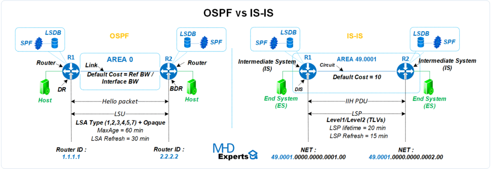

# Def 

-	**<u>BGP**</u> *Border Gateway Protocol (protocole de passerelle en bordure)* - **[RFC 4271](http://abcdrfc.free.fr/rfc-vf/pdf/rfc1772.pdf) + [RFC 1772](http://abcdrfc.free.fr/rfc-vf/pdf/rfc1772.pdf)** : <u>Protocole de routage dynamique</u> qui permet à Internet de fonctionner en facilitant l'échange d'informations de routage entre les différents réseaux qui composent l'Internet global.

Précisément, c'est un protocole de passerelle externe standardisé conçu pour échanger des informations de routage et de joignabilité entre des systèmes autonomes (AS) sur Internet. Il est classé comme un protocole de routage à vecteur de chemin, ce qui signifie qu'il prend des décisions de routage basées sur les chemins et les politiques de réseau.

Le BGP fonctionne en établissant des sessions TCP entre des routeurs, appelés pairs BGP, pour échanger des informations de routage.

Il est également utilisé pour supporter des fonctionnalités avancées comme les réseaux privés virtuels (VPN) et le routage multicast.

Il existe deux types principaux de BGP :

-	**<u>eBGP</u>** *External BGP* : utilisé quand **2 ROUTEURS communiquent** entre 2 différents systèmes autonomes

-	**<u>iBGP</u>** *Internal BGP* : utilisé quand **2 ROUTEURS communiquent** au sein d'un même système autonome.

## <u>**ATTENTION**</u>
Pour iBGP, cela ne concerne que des informations venant de l'<u>EXTERIEUR</u> du AS. **C'est-à-dire que si un routeur `R1` recois une info d'un AS exterieur, et que ce fameux paquet exterieur (qui est chez `R1`) voit sa destination un autre routeur qui est `R2`, alors ce protocole <u>iBGP</u> est utilisé. Sinon, si c'est un paquet interne à l'AS qui doit atteindre un routeur du même AS, alors ce sera le protocole <u>OSPF</u> qui est utilisé.**

 
 

-	**<u>AS</u>** *Autonomous System* - **[RFC 1930](http://abcdrfc.free.fr/rfc-vf/pdf/rfc1930.pdf) + [RFC 4271](http://abcdrfc.free.fr/rfc-vf/pdf/rfc1772.pdf)** : Un ensemble de routeurs sous une seule administration technique. Une administration technique peut être un Fournisseur d'Accès à Internet (FAI), une entreprise, une université, etc... Chaque AS est défini par un numéro unique appelé Autonomous System Number (ASN) défini par l'[IANA](https://www.iana.org/). Ils permettent de définir une politique de routage <u>au sein de leur réseau</u>.

-	**<u>OSPF**</u> *Open Shortest Path First (itinéraire ouvert le plus court en premier)* - **[RFC 2328](https://www.rfc-editor.org/rfc/rfc2328.txt)** : <u>Protocole de routage interne</u> (donc à l'**INTERIEUR** d'un AS) <u>**IP** à état de lien</u> qui achemine des paquets au sein d'un AS. Il est utilisé par les routeurs réseau pour identifier dynamiquement les itinéraires disponibles les plus rapides et les plus courts afin d'envoyer les paquets vers leur destination. <u>**Il est largement utilisé dans les réseaux d'entreprise et les environnements où la compatibilité avec les protocoles IP est cruciale.**</u> Ce protocole utilise l'algorithme de pathfinding [Dijkstra](https://fr.wikipedia.org/wiki/Algorithme_de_Dijkstra) pour arriver à destination.

## <u>**ATTENTION**</u>
Pour OSPF, cela ne concerne que des informations venant de l'<u>INTERIEUR</u> de  l'AS. **C'est-à-dire que si un routeur `R1` recois une info d'un routeur du même AS et que sa destination est un autre routeur `R2` qui fait parti lui aussi du même AS, alors ce protocole <u>OSPF</u> est utilisé. Sinon, si c'est un paquet qui provient de l'exterieur de l'AS, alors ce sera le protocole <u>iBGP</u> qui est utilisé.**

-	**<u>IS-IS Routing</u>** *Intermediate System to Intermediate System* - **[RFC 1195](https://www.rfc-editor.org/rfc/rfc1195.txt)** : <u>Protocole de routage interne</u> (donc à l'**INTERIEUR** d'un AS) <u>**OSI** multi-protocoles à états de lien</u> qui utilise aussi [Dijkstra](https://fr.wikipedia.org/wiki/Algorithme_de_Dijkstra). IS-IS peut paraitre similaire à OSPF, car lui aussi est un protocole de routage interne multicast qui utilise Dijkstra, il est différencié de OSPF par le fait que c'est un protocole de routage réseau **OSI** et n'utilise pas IP pour la transmission des messages. Plus précisément, <u>**ce protocole a été adapté pour les réseaux IP et est souvent utilisé par les FAI en raison de sa flexibilité et de son extensibilité.**</u> [<Pour plus de compréhension et d'explication sur **<u>OSPF vs IS-IS</u>**>](https://mhd-experts.com/2020/04/16/ospf-vs-is-is-le-face-a-face/)</u>.

-	**<u>VXLAN</u>** *Virtual eXtensible Local Area Network (Réseau Local eXtensible Virtuel)* - **[RFC 7348](https://www.rfc-editor.org/rfc/rfc7348.txt)** :
	- <u>LAN</u> *Local Area Network (Réseau Local)* - **[RFC 1918](https://www.rfc-editor.org/rfc/rfc1918.html)** : Réseau informatique qui couvre une zone géographique limitée, comme un bâtiment. Les LAN sont utilisés pour connecter des dispositifs informatiques dans une zone restreinte afin de partager des ressources et des informations. LAN utilise les plages d'adressage IP définies par la [RFC 1918](https://www.rfc-editor.org/rfc/rfc1918.html). Et ces adresses ne sont pas routés sur Internet, seul des échanges entre 2 (OU PLUSIEURS) machines au sein du LAN est possible. C'est comme cela qu'on fait des LAN sur *Counter Strike* : toutes les machines sont connectées entre elles en LAN ce qi leur permet d'échanger leur informations et de pouvoir jouer en à plusieurs, chacun son PC, en **MULTIJOUEUR LOCAL**.

	- <u>VLAN</u> *Virtual Local Area Network (Réseau Local Virtuel)* : Le VLAN permet aux ingénieurs de contrôler le système de réseau tout en améliorant la sécurité et l'évolutivité. Le LAN virtuel permet de segmenter les réseaux LAN en groupes distincts, ce qui renforce la sécurité du réseau et simplifie la gestion. Les données d'un groupe restent isolées des autres groupes. <u>Le VLAN réduit le trafic de diffusion et améliore l'efficacité du réseau en **segmentant/encapsulant chaque trame logiquement un grand réseau en réseaux de taille plus réduite**.</u> Il existe 2 méthodes courantes de configuration VLAN (statique et dynamique) et plusieurs catégories de <u>VLAN dynamiques</u>. [<Pour plus de détail sur les <u>**différentes méthodes de configuration VLAN et ses différentes catégories**</u>>](https://community.fs.com/fr/article/vlan-how-does-it-change-your-network-management.html) (Mais aussi sa [page Wikipédia](https://en.wikipedia.org/wiki/VLAN)).

	- <u>Ethernet</u> : Ethernet est un protocole de communication utilisé pour les réseaux informatiques, exploitant la commutation de paquets. Il réalise les fonctions de la **couche physique** et de la **couche liaison de données** (couches 1 et 2) du modèle OSI. C'est une norme internationale ISO/IEC/IEEE 8802-3. [<u>\<Pour en savoir plus\></u>](https://fr.wikipedia.org/wiki/Ethernet). 

	- <u>Trame Ethernet</u> : Dans un réseau Ethernet, les appareils partagent des paquets de données entre eux, également appelés paquets Ethernet. Leur contenu comprend la trame Ethernet (souvent appelée trame de données), qui est à son tour divisée en plusieurs ensembles de données. Ces ensembles de données se composent d’un code binaire qui fournit des informations importantes, notamment les adresses, les informations de contrôle, les données utilisateur et les sommes de contrôle. La trame est située sur la **couche de liaison** dans le modèle OSI (couche 2). Les trames Ethernet contiennent des informations comme les adresses MAC (Media Access Control) des dispositifs source et de destination. [<Pour plus d'info sur le fonctionnement d'une <u>**trame ethernet**</u>>](https://www.ionos.fr/digitalguide/serveur/know-how/trame-ethernet/).

	- <u>UDP</u> *User Datagramme Protocol (Protocole de Datagramme Utilisateur)* - **[RFC 768](https://www.rfc-editor.org/rfc/rfc768.txt)** : Un des principaux **protocoles de télécommunication** utilisés par Internet. Il fait partie de la **couche transport du modèle OSI** (4eme couche), comme TCP. UDP est une méthode normalisée de **transfert de données entre deux ordinateurs sur un réseau**. Par rapport à d'autres protocoles, UDP accomplit ce processus de manière simple : <u>**il envoie des paquets (unités de transmission de données) directement à un ordinateur cible, sans établir de connexion préalable, sans indiquer l'ordre de ces paquets ni vérifier s'ils sont arrivés comme prévu**</u>. (Les paquets UDP sont appelés « datagrammes »). Ce protocole ressemble beaucoup a [TCP](https://fr.wikipedia.org/wiki/Transmission_Control_Protocol), mais il est moins fiable. *Par exemple : Youtube ou les sites de streaming utilisent le protocole UDP pour envoyer des données, au lieu d'envoyer tout d'un coup, il envoit toutes les infor;ation en continue.* **Pour conclure : <u>Le protocole UDP est couramment utilisé dans les communications sensibles au facteur temps</u>**. [<u><Pour mieux comprend **UDP** et ses différences avec **TCP**></u>](https://www.cloudflare.com/fr-fr/learning/ddos/glossary/user-datagram-protocol-udp/).

Ces termes étaient important pour comprendre ce qu'est réellement le **VXLAN**. En une phrase : <u>VXLAN est une technologie qui permet de créer des **réseaux virtuels (VLAN)** qui peuvent s'étendre au-delà des limites physiques d'un **réseau local (LAN)**.</u> (Et aussi le VXLAN s'effectue au niveau de la couche 3 du modèle OSI)
### Plus précisément :
<u>**VXLAN est une technologie de virtualisation de réseau qui permet de créer des réseaux virtuels étendus sur des réseaux physiques. Elle est particulièrement utile dans les environnements de centres de données et de cloud computing, où la flexibilité et l'évolutivité sont cruciales.**</u>
 
### Comment le VXLAN fonctionne ?

1. <u>Encapsulation</u> : VXLAN encapsule les trames Ethernet dans des paquets UDP pour les transporter sur un réseau IP. Cela permet de créer des réseaux virtuels qui peuvent **s'étendre au-delà des limites physiques d'un réseau local**.

2. <u>Overlay Networking</u> : VXLAN crée des réseaux superposés (overlay networks) qui peuvent s'étendre sur des réseaux IP sous-jacents (underlay networks). **Cela signifie que les réseaux virtuels peuvent traverser des réseaux physiques, offrant ainsi une grande flexibilité dans la conception et la gestion des réseaux**. *De plus, cela contribue aussi a la conception des **VTEPs** (VXLAN Tunnel EndPoints)*. 

3. <u>VTEPs (VXLAN Tunnel EndPoints)</u> : Les VTEPs sont des dispositifs qui **encapsulent et décapsulent les trames Ethernet dans les paquets UDP**, permettant ainsi le transport des données à travers le réseau IP. On appelle cela des "tunnels" car une fois l'encapsulation faite, les routeurs qui transmettent l'information entre la source et la destination ne peuvent pas voir en claire le contenu de l'info, jusqu'au destinataire. <u>**Comme un tunnel, on ne voit que ce qui "rentre" et que ce qui "sort", et pas ce qui se passe dans le tunnel**</u>. 

4. <u>*Scalabilité*</u> : Avec jusqu'à <u>**16 millions de réseaux logiques disponibles (exactement 16 777 215)**</u> grâce à un **identifiant de réseau VXLAN (VNI - *Virtual Network Identifier*) de `24 bits`** (contrairement aux 4096 seulement pour VLAN avec un VNI de `12 bits`), <u>VXLAN offre une **ÉVOLUTIVITÉ** bien supérieure</u>, permettant à l'entreprise de créer autant de réseaux virtuels que nécessaire pour ses différents départements ou applications.

5. <u>*Flexibilité*</u> : VXLAN permet de créer des réseaux virtuels qui peuvent s'**étendre au-delà des limites physiques d'un réseau local**, offrant ainsi une grande flexibilité dans la conception et la gestion des réseaux.

6. <u>*Routage en couche 3*</u> : VXLAN utilise le **routage de couche 3 (IP) pour transporter les trames Ethernet (couche 2) à travers le réseau**. Le routage de couche 3 permet d'utiliser des techniques comme le <u>**multipath à coût égal ([ECMP - *Equal-Cost Multi-Path*](https://fr.wikipedia.org/wiki/Equal-cost_multi-path_routing))**</u>, qui répartit le trafic sur plusieurs chemins de manière équilibrée, augmentant ainsi l'utilisation des ressources réseau et réduisant les goulots d'étranglement.

7. <u>*Évite les limitations de **[STP (Spanning Tree Protocol)](https://fr.wikipedia.org/wiki/Spanning_Tree_Protocol)***</u> ***(CE 7ÈME POINT PEUT-ÊTRE DISPENSABLE)*** : STP est un protocole utilisé dans les réseaux Ethernet pour éviter les boucles de réseau, qui peuvent causer des **tempêtes de diffusion ([broadcast storms](https://fr.wikipedia.org/wiki/Broadcast_storm`))** et des instabilités. Il fonctionne en désactivant certains chemins redondants dans le réseau, créant ainsi une topologie en arbre sans boucles. VXLAN évite ses limitations : *(Les 3 prochains points, je vous laisse faire vos propres recherches sur les **limitations de STP** et comment VXLAN les évite en faisant mieux le boulot que **STP**)*
	- <u>Blocage de Chemins Redondants</u> 
	- <u>Convergence Lente</u>
	- <u>Complexité de Gestion</u>

## Pour conclure sur VXLAN

**VXLAN** est une révolution technologique par rapport aux **VLANs traditionnels** en raison de sa capacité à créer des <u>**réseaux virtuels étendus, évolutifs et flexibles**</u>. Il permet de surmonter les limites des VLANs traditionnels en offrant une <u>**meilleure scalabilité, flexibilité et efficacité dans la gestion des réseaux modernes**</u>, en particulier dans les environnements de <u>*cloud computing et les grands centres de données*</u>. [<Pour en savoir plus sur **VXLAN**>](https://www.fibermall.com/fr/blog/vxlan.htm#) + [Source complémentaire](https://www.juniper.net/fr/fr/research-topics/what-is-vxlan.html)

### *Ce schéma définitif conclue tout ce qu'on a pu voir sur VXLAN et son fonctionnement :* 

 
 
 

-	**<u>VXLAN Static (Unicast)</u>** : Static VXLAN utilise des <u>entrées de réplication statiques pour répliquer les paquets entre les Points de Terminaison de Tunnel VXLAN (VTEPs - VXLAN Tunnel EndPoints)</u>. Cela signifie que chaque VTEP a une <u>liste préconfigurée des autres VTEPs</u> auxquels il doit envoyer les paquets. Il fonctionne de la manière suivant : <u>**Ingress Replication**</u>. Chaque VTEP envoie des copies **des paquet de <u>broadcast (*diffusion*)</u> de <u>multicast (*multidiffusion*)</u> et de <u>unknown unicast (*monodiffusion inconnue*)</u>** à **TOUS LES VTEPs D'UNE LISTE QUI A ÉTÉ PRE-CONFIGURÉE**.

## On appelle cela "gérer le <u>**Trafic BUM**</u> (Broadcast - Unknown unicast - Multicast)".
- Cela se fait via des **tunnels unicast**, où chaque paquet est envoyé <u>**individuellement à chaque VTEP distant**</u>. Simple a configuré et un contrôle efficace des chemins des paquets, mais son **évolutivité** est restraint par son inéfficacité à grande échelle à cause de l'**Ingress Replication** qui peut surcharger le réseau. Et doit chaque fois être mis à jour manuellement pour ajouter un nouveau VTEP à sa liste. 

-	**<u>VXLAN Dynamic (Multicast)</u>** : Dynamic VXLAN utilise des <u>groupes multicast</u> pour la diffusion du **trafic BUM**. Cela siginifie que les **paquet BUM** sont envoyés à un groupe multicast, et tous les VTEPs abonnés à ce groupe reçoivent les paquets, seulement les VTEPs interessés recoivent ces paquets. Il fonctionne en utilisant le **Multicast** tout simplement. Les VTEPs envoient les paquets à un groupe multicast IP. Les routeurs du réseau sous-jacent qui supportent le multicast se chargent de répliquer les paquets vers tous les VTEPs abonnés à ce groupe. Une solution qui ne surcharge pas la bande passante car cela envoie les paquets qu'aux destinataires interessés + c'est une solution **ÉVOLUTIVE** adaptée aux réseaux de grande envergure avec une quantité importante de trafic BUM. MAIS cela est plus complexe à mettre en place et à maintenir. Et la diffusion du trafic BUM via multicast nécessite souvent l'utilisation de [PIM (Protocol Independent Multicast)](https://en.wikipedia.org/wiki/Protocol-Independent_Multicast) et d'un point de rendez-vous, ce qui ajoute de la complexité au réseau. 

- Sources complémentaire :
  - [Multicast vs Ingress Replication](https://community.cisco.com/t5/documents-de-routage-et-commutation/multicast-vs-ingress-replication-fabric-vxlan-evpn/ta-p/4951512)
  - [Differences between Dynamic and Static VXLAN Modes](https://docs.starlingx.io/datanet/openstack/differences-between-dynamic-and-static-vxlan-modes.html)
  - [Multicast vs Ingress Replication (advanced)](https://nwktimes.blogspot.com/2018/03/vxlan-part-iv-underlay-network_20.html)

- **<u>Trafic BUM</u>** *Broadcast - Unknown unicast - Multicast* : 

-	**<u>Bridge</u>** : 
