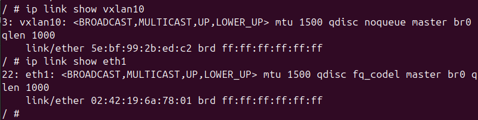

# 1. Création du `bridge`
```sh
ip link add br0 type bridge
```

# 2. Activation du `bridge`
```sh
ip link set dev br0 up
```

# 3. Attribution d'une adresse IP à une interface <u>eth0</u>
```sh
ip addr add 10.1.1.1/24 dev eth0
```

# 4. Création d'une interface `VXLAN`
```sh
ip addr add name vxlan10 type vxlan id 10 dev eth0 remote 10.1.1.2 local 10.1.1.1 dstport 4789
```

- `ip addr add` : ajouter une nouvelle adresse IP ou une nouvelle interface réseau
- `name vxlan10` : attribue le nom "vxlan10" à l'interface qui sera créée
- `type vxlan` : spécifie que le type d'interface que l'on créé, ici `VXLAN`
- `id 10` : l'identifiant VXLAN ---> **VNI (VXLAN Number Identifier)**
- `dev eth0` : indique l'interface physique sous-jacente (ici `eth0`) qui sera utilisée pour transporter le trafic VXLAN
- `remote 10.1.1.2` : spécifie l'adresse IP du `VTEP` **distant** (point de terminaison VXLAN **distant**, dans notre cas : "router_jbettini-2" par exemple si nous sommes sur "router_jbettini-1") ---> **<u>C'est l'adresse IP de l'autre extrémité du tunnel VXLAN</u>**
- `dstport 4789` : spécifie l'adresse IP du `VTEP` **local** (point de terminaison VXLAN **local**) ---> **<u>C'est l'adresse IP de l'interface locale qui sera utilisée pour le tunnel VXLAN</u>**
- `dstport 4789` : indique le port de destination `UDP` utilisé pour le trafic VXLAN, `4789` est le port standard pour VXLAN

# 5. Attribution d'une Adresse IP à l'Interface <u>VXLAN</u> et son activation
```sh
ip addr add 20.1.1.1/24 dev vxlan
ip link set dev vxlan10 up
```

# 6. Ajout des Interfaces au `bridge`
```sh
brctl addif br0 eth1
brctl addif br0 vxlan10
```

- `brctl` : "bridge control"
- `addif` : "add interface"
- `br0 eth1` : ajoute l'interface physique `eth1` au bridge `br0`


```sh
#!/bin/sh
# 1
ip link add br0 type bridge

# 2
ip link set dev br0 up

# 3
ip addr add 10.1.1.1/24 dev eth0

# 4
ip addr add name vxlan10 type vxlan id 10 dev eth0 remote 10.1.1.2 local 10.1.1.1 dstport 4789

# 5
ip addr add 20.1.1.1/24 dev vxlan
ip link set dev vxlan10 up

# 6
brctl addif br0 eth1
brctl addif br0 vxlan10
```

# 7. On fait la même chose sur le second routeur

```sh
#!/bin/sh
# 1
ip link add br0 type bridge

# 2
ip link set dev br0 up

# 3
ip addr add 10.1.1.2/24 dev eth0

# 4
ip addr add name vxlan10 type vxlan id 10 dev eth0 remote 10.1.1.1 local 10.1.1.2 dstport 4789

# 5
ip addr add 20.1.1.2/24 dev vxlan
ip link set dev vxlan10 up

# 6
brctl addif br0 eth1
brctl addif br0 vxlan10
```

# 8. Attribution d'une adresse IP aux <u>machines hôtes</u>

```sh
ip addr add 30.1.1.1/24 dev eth1
```
